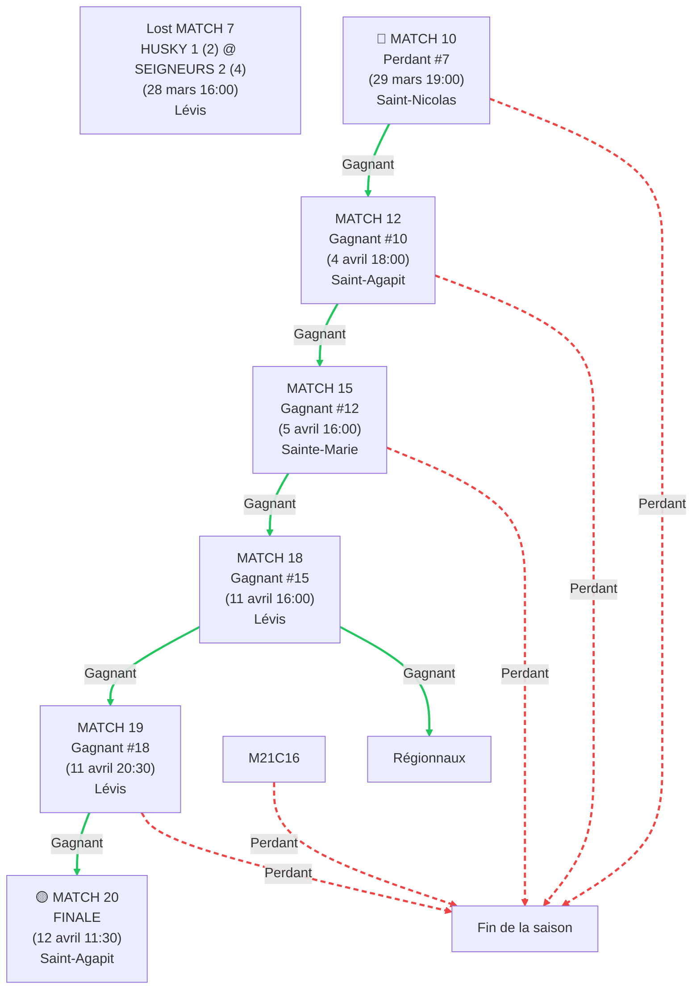

# horaire-serie-2026
# 🏒 Tournoi Séries 2026 - Chemins de Dépendances
## 🟣 HUSKY 1 (m21c) - Gabriel

### Structure des Dépendances

### 📍 Chemins Vers la FINALE (Match 20)

| Match | Chemins Possibles | Nombre de Chemins |
|-------|-------------------|-------------------|
| **7** | DIRECT | 1 |
| **10** | L7 | 1 |
| **12** | L7 → W10 | 1 |
| **15** | L7 → W10 → W12 | 1 |
| **18** | L7 → W10 → W12 → W15 | 1 |
| **19** | L7 → W10 → W12 → W15 → W18 | 1 |
| **20** | L7 → W10 → W12 → W15 → W18 → W19 | 1 |

---

## 📈 Statistiques

## 🔑 Légende

- **W#** = Gagnant du match #
- **L#** = Perdant du match #
- **OU** = Chemin alternatif possible
- 🔴 = Match initial (garantis)
- 🟡 = Match final (potentiel)
- Couleurs : gradient représentant la progression du tournoi

---
