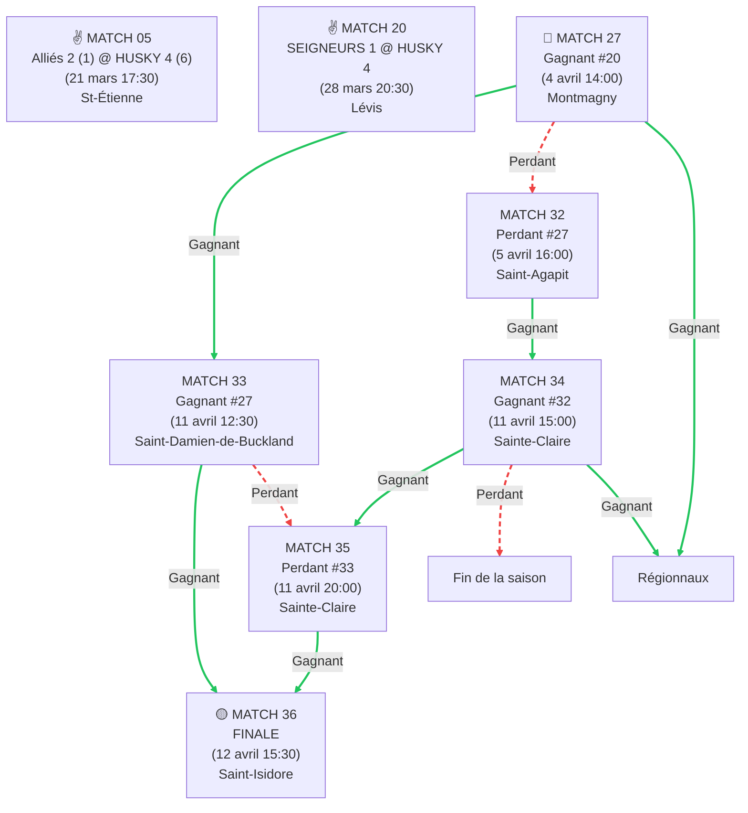
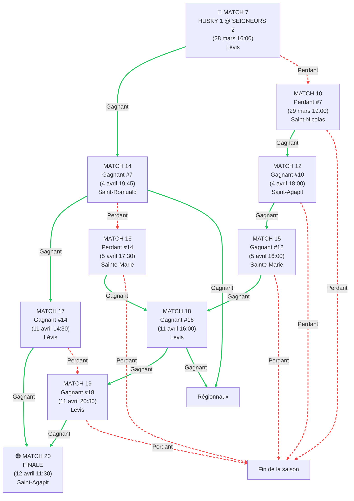

# horaire-serie-2026
# 🏒 Tournoi Séries 2026 - Chemins de Dépendances

## 📊 Résumé

Ce document visualise graphiquement les chemins possibles que les équipes **Husky 4 (Xavier)** et **Husky 1 (Gabriel)** peuvent emprunter lors du tournoi.

---

## 🔵 HUSKY 4 (m18b) - Xavier

### Structure des Dépendances

### 📍 Chemins Vers la FINALE (Match 36)

| Match | Chemins Possibles | Nombre de Chemins |
|-------|-------------------|-------------------|
| **20** | DIRECT | 1 |
| **27** | W20 | 1 |
| **24** | L20 | 1 |
| **32** | W20 → L27 | 1 |
| **33** | W20 → W27 | 1 |
| **29** | L20 → W24 | 1 |
| **34** | L20 → W24 → W29 → W31 **OU** W20 → L27 → W32 | 2 |
| **31** | L20 → W24 → W29 | 1 |
| **35** | L20 → W24 → W29 → W31 → W34 **OU** W20 → L27 → W32 → W34 **OU** W20 → W27 → L33 | 3 |
| **36** | L20 → W24 → W29 → W31 → W34 → W35 **OU** W20 → L27 → W32 → W34 → W35 **OU** W20 → W27 → L33 → W35 **OU** W20 → W27 → W33 | 4 |

---

## 🟣 HUSKY 1 (m21c) - Gabriel

### Structure des Dépendances

### 📍 Chemins Vers la FINALE (Match 20)

| Match | Chemins Possibles | Nombre de Chemins |
|-------|-------------------|-------------------|
| **7** | DIRECT | 1 |
| **10** | L7 | 1 |
| **14** | W7 | 1 |
| **12** | L7 → W10 | 1 |
| **16** | W7 → L14 | 1 |
| **15** | L7 → W10 → W12 | 1 |
| **17** | W7 → W14 | 1 |
| **18** | L7 → W10 → W12 → W15 **OU** W7 → L14 → W16 | 2 |
| **19** | L7 → W10 → W12 → W15 → W18 **OU** W7 → L14 → W16 → W18 **OU** W7 → W14 → L17 | 3 |
| **20** | L7 → W10 → W12 → W15 → W18 → W19 **OU** W7 → L14 → W16 → W18 → W19 **OU** W7 → W14 → L17 → W19 **OU** W7 → W14 → W17 | 4 |

---

## 📈 Statistiques

### Densité de Chemins

| Équipe | Match Initial | Match Final | Chemins à la Finale |
|---------|---------------|-------------|-------------------|
| **Husky 4** | Match 20 | Match 36 | 4 chemins |
| **Husky 1** | Match 7 | Match 20 | 4 chemins |

### Profondeur du Tournoi

| Équipe | Profondeur Max (victoires/défaites) | Nombre de Matches |
|--------|-------------------------------------|------------------|
| **Husky 4** | 5 niveaux (W20→W27→W33→W35→W36) | 10 matches |
| **Husky 1** | 5 niveaux (L7→W10→W12→W15→W18→W19) | 10 matches |

---

## 🔑 Légende

- **W#** = Gagnant du match #
- **L#** = Perdant du match #
- **OU** = Chemin alternatif possible
- 🔴 = Match initial (garantis)
- 🟡 = Match final (potentiel)
- Couleurs : gradient représentant la progression du tournoi

---

## 💡 Interprétation

### Pour Xavier (Husky 4)
- **Scénario le plus court**: Gagner en match 20 → Gagner en match 27 → ... → 4 victoires jusqu'à la finale
- **Scénario alternatif**: Perdre en match 20 → Gagner en matches 24, 29, 31 → ... → 4 victoires jusqu'à la finale
- **Flexibilité**: 4 chemins différents possibles pour atteindre la finale (match 36)

### Pour Gabriel (Husky 1)
- **Scénario optimal**: Gagner en match 7 → Gagner en match 14 → ... → 4 victoires jusqu'à la finale
- **Scénario alternatif**: Perdre en match 7 → Gagner en matches 10, 12, 15 → ... → 4 victoires jusqu'à la finale
- **Flexibilité**: 4 chemins différents possibles pour atteindre la finale (match 20)

---

