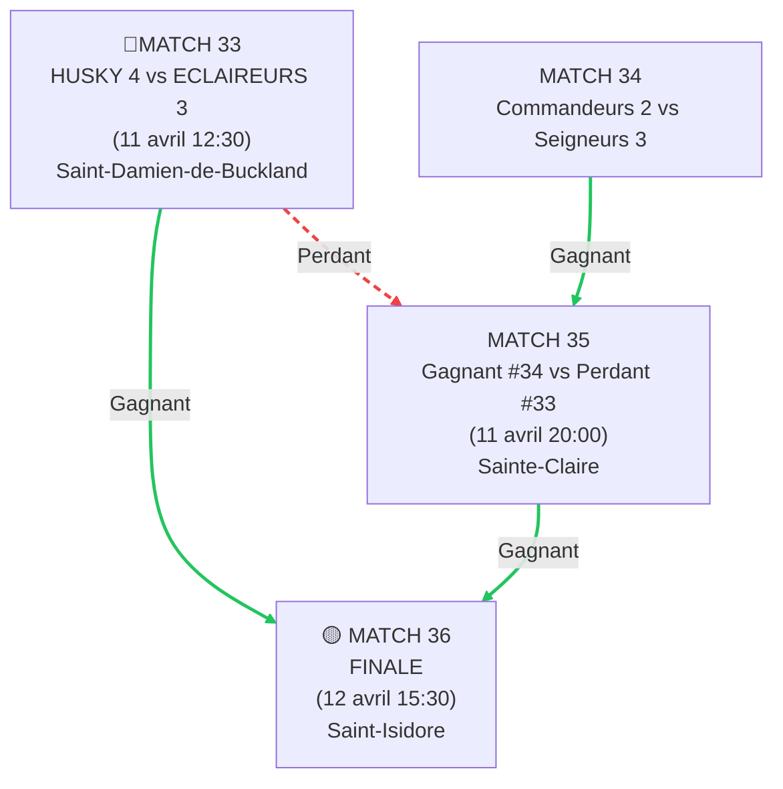

# horaire-serie-2026
# 🏒 Tournoi Séries 2026 - Chemins de Dépendances
## 🔵 HUSKY 4 (m18b) - Xavier

### Structure des Dépendances

```mermaid
graph TD
    M18B33["🔴MATCH 33<br/>HUSKY 4 vs ECLAIREURS 3<br/>(11 avril 12:30)<br/>Saint-Damien-de-Buckland"]
    M18B33 -->|Gagnant| M18B36["🟡 MATCH 36<br/>FINALE<br/>(12 avril 15:30)<br/>Saint-Isidore"]
    M18B34["MATCH 34<br/>Commandeurs 2 vs Seigneurs 3"] -->|Gagnant| M18B35["MATCH 35<br/>Gagnant #34 vs Perdant #33<br/>(11 avril 20:00)<br/>Sainte-Claire"]
    M18B35 -->|Gagnant| M18B36
    M18B33 -->|Perdant| M18B35

    linkStyle 0,1,2 stroke:#22c55e,stroke-width:2.5px
    linkStyle 3 stroke:#ef4444,stroke-width:2.5px,stroke-dasharray:6 4
    
    


```

