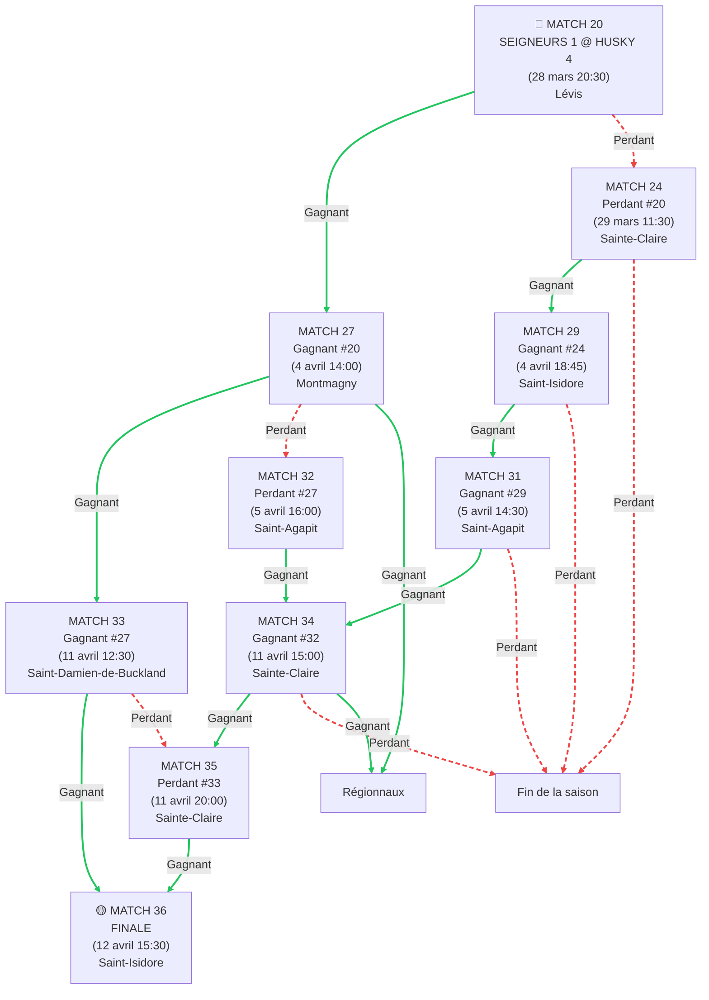

# horaire-serie-2026
# 🏒 Tournoi Séries 2026 - Chemins de Dépendances
## 🔵 HUSKY 4 (m18b) - Xavier

### Structure des Dépendances

### 📍 Chemins Vers la FINALE (Match 36)

| Match | Chemins Possibles | Nombre de Chemins |
|-------|-------------------|-------------------|
| **20** | DIRECT | 1 |
| **27** | W20 | 1 |
| **24** | L20 | 1 |
| **32** | W20 → L27 | 1 |
| **33** | W20 → W27 | 1 |
| **29** | L20 → W24 | 1 |
| **34** | L20 → W24 → W29 → W31 **OU** W20 → L27 → W32 | 2 |
| **31** | L20 → W24 → W29 | 1 |
| **35** | L20 → W24 → W29 → W31 → W34 **OU** W20 → L27 → W32 → W34 **OU** W20 → W27 → L33 | 3 |
| **36** | L20 → W24 → W29 → W31 → W34 → W35 **OU** W20 → L27 → W32 → W34 → W35 **OU** W20 → W27 → L33 → W35 **OU** W20 → W27 → W33 | 4 |

---

## 🔑 Légende

- **W#** = Gagnant du match #
- **L#** = Perdant du match #
- **OU** = Chemin alternatif possible
- 🔴 = Match initial (garantis)
- 🟡 = Match final (potentiel)
- Couleurs : gradient représentant la progression du tournoi

